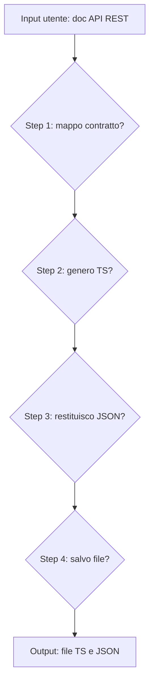

# Dev Agent Ideathon — API Generator

> Setup ambiente: vedi `readme.ipynb`. Lavorare su branch separato da `develop`.

## Avvio

```bash
python -m streamlit run src/main.py
```

## Stack

- **UI**: Streamlit (`src/ui/app.py` + `src/ui/logs_page.py`)
- **Agent**: `DevAgent` — OpenAI `gpt-4o`, `max_steps=4`, tools: `map_api_rest`, `generate_ts_api`, `create_file_ts_api`
- **Client**: `_FAST_CLIENT` (OpenAI) / `_LOCAL_CLIENT` (Ollama `gemma3:4b`, non ancora usato)
- **Observability**: agent run e tool call persistiti in JSON, visibili in UI

## Struttura

```
src/
  main.py
  agent/devagent.py       # singleton DevAgent
  client/client.py        # init client LLM
  tool/tool.py            # map_api_rest, generate_ts_api, create_file_ts_api
  tool/model.py           # contratti Pydantic
  assets/apiTemplate.ts   # template TS di riferimento
  assets/Api/<Entity>/    # output generato da create_file_ts_api
  ui/                     # pagine Streamlit
  observability/          # decoratori, pricing, store JSON
test/                     # contract test (pytest)
```

## Tool

| Tool | Tipo | Descrizione |
|---|---|---|
| `map_api_rest` | LLM | Doc testuale API REST → `MapApiRestToolResponse` JSON |
| `generate_ts_api` | LLM | Contratto JSON → contenuto di `entity.types.ts` + `entity.api.ts` |
| `create_file_ts_api` | deterministico | Scrive i due file in `src/assets/Api/<EntityName>/` |


## Schema logico agente

L'agente segue una pipeline deterministica a step:



**Descrizione:**
- L’agente riceve la documentazione testuale.
- Esegue in sequenza:
  1. Mappatura contratto API.
  2. Generazione codice TypeScript.
  3. Restituzione JSON generato.
  4. Salvataggio file TypeScript.
- Output: JSON e file TypeScript pronti all’uso.

## Test

```bash
pytest test/ -v
```

